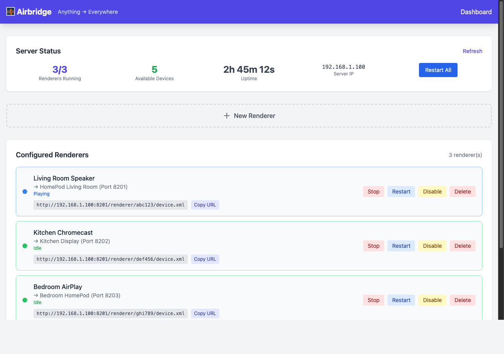
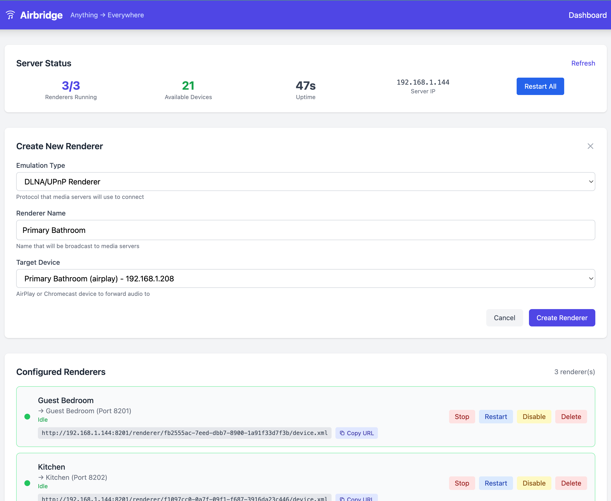

# Airbridge

> Anything → Everywhere: Bridge DLNA audio streams to AirPlay & Chromecast

Airbridge creates virtual DLNA renderers that forward audio to AirPlay speakers and Chromecast devices. This allows media servers like [Music Assistant](https://music-assistant.io/) to stream to these devices through DLNA.



## Why?

Some AirPlay devices (like [Juke Audio](https://jukeaudio.com/) multi-zone speakers) have compatibility issues with certain AirPlay implementations. Airbridge works around this by:

1. Presenting itself as standard DLNA/UPnP renderers
2. Receiving audio streams via HTTP
3. Forwarding to AirPlay devices using [libraop](https://github.com/philippe44/libraop)
4. Or sending media URLs to Chromecast devices via CASTV2

## Features

- 🎵 Virtual DLNA renderer per AirPlay/Chromecast zone
- 📡 Automatic device discovery (mDNS for both AirPlay and Chromecast)
- 📺 Chromecast support - cast DLNA audio to Chromecast devices
- 🌐 Web admin interface with real-time status updates via WebSocket
- 🎛️ Live playback status (Playing/Idle/Paused) with instant UI updates
- ⚙️ YAML configuration for device filtering and aliases
- 🔊 Volume control support
- 🐳 Docker deployment with Unraid support
- ✅ Comprehensive test suite with CI/CD

## Status

⚠️ **Early Development (v0.x)** - Core functionality works but expect breaking changes, bugs, and missing features. Not yet recommended for production use.

### What works:
- DLNA renderer creation and discovery
- Audio streaming to AirPlay devices
- Chromecast as output target (URL-based media playback)
- Web admin interface with live status updates
- Real-time playback state via WebSocket
- Docker/Unraid/Home Assistant deployment
- Full test suite with CI/CD pipeline

### Known Limitations:
- Chromecast *receiver* support (casting FROM apps like Spotify TO Airbridge) is blocked by Google's device authentication requirements

## Quick Start

### Option 1: Docker (Recommended)

```bash
docker run -d --network=host -v airbridge-data:/data ghcr.io/kenyonj/airbridge:latest
```

Access the web admin at `http://localhost:8200/admin`

### Option 2: Build from Source

#### 1. Download cliraop binary

Get the pre-built `cliraop` binary for your platform from [libraop releases](https://github.com/philippe44/libraop/releases) and place it in the `bin/` directory:

```bash
mkdir -p bin
# Download appropriate binary for your platform
# Rename to: bin/cliraop-macos-arm64, bin/cliraop-linux-amd64, etc.
chmod +x bin/cliraop-*
```

#### 2. Build airbridge

```bash
make build
```

#### 3. Run

**Web admin interface (recommended):**
```bash
./bin/airbridge --web
```

**Bridge a single device:**
```bash
./bin/airbridge --serve --target "Guest Bedroom"
```

**Test streaming to a device:**
```bash
./bin/airbridge --test "Guest Bedroom"
```

## Usage

```
Usage of ./bin/airbridge:
  -db string
      Path to SQLite database (default "./airbridge.db")
  -port int
      HTTP port for DLNA server (default 8200)
  -serve
      Run as DLNA renderer server (single device)
  -target string
      Target AirPlay device name (for serve mode)
  -test string
      Test streaming to device (by name)
  -version
      Print version
  -web
      Run with web admin interface
```

## Configuration

Create a `config.yaml` file (or place at `~/.config/airbridge/config.yaml`):

```yaml
# HTTP port for the first renderer (subsequent use incremental ports)
http_port: 8200

# Enable automatic discovery of AirPlay devices
auto_discover: true

# Prefix for DLNA friendly names
name_prefix: "Airbridge"

# Optional: Filter to only include specific devices
device_filter:
  - "Kitchen"
  - "Living Room"
  - "Guest Bedroom"

# Optional: Device-specific configuration
devices:
  - name: "Kitchen"
    alias: "Kitchen Bridge"
    port: 8201
  
  - name: "Office"
    enabled: false  # Exclude this device
```

## Architecture

```
┌─────────────┐     DLNA/UPnP     ┌─────────────────┐     RAOP      ┌──────────────┐
│ Media       │ ────────────────▶ │   Airbridge     │ ────────────▶ │ AirPlay      │
│ Server      │                   │                 │               │ Speakers     │
│ (MA, Plex)  │                   │ ┌─────────────┐ │               └──────────────┘
└─────────────┘                   │ │ Virtual     │ │
                                  │ │ DLNA        │ │     CASTV2    ┌──────────────┐
                                  │ │ Renderers   │ │ ────────────▶ │ Chromecast   │
                                  │ └─────────────┘ │   (URL-based) │ Devices      │
                                  └─────────────────┘               └──────────────┘
```

### Device Types

| Type | Protocol | How it works |
|------|----------|--------------|
| **AirPlay** | RAOP via cliraop | Airbridge receives audio, transcodes, and *pushes* to device |
| **Chromecast** | CASTV2 via go-chromecast | Airbridge sends URL, device *pulls* media directly |

## How It Works

1. **Discovery**: Airbridge uses mDNS to discover AirPlay (`_raop._tcp`) and Chromecast (`_googlecast._tcp`) devices
2. **SSDP**: For each device, it advertises a virtual DLNA MediaRenderer
3. **SOAP**: When a media server (like Music Assistant) connects, it handles AVTransport and RenderingControl SOAP requests
4. **Streaming**: 
   - **AirPlay**: Audio is received via HTTP and piped to the `cliraop` binary, which streams to the device
   - **Chromecast**: The media URL is sent to the Chromecast, which fetches and plays it directly

## Use with Music Assistant

1. Start airbridge: `./bin/airbridge --web`
2. In Music Assistant, go to Settings → Players
3. You should see "Airbridge (Device Name)" devices appear as DLNA players
4. Select a device and start playing music!

## Web Admin Interface

The web admin (`--web` mode) provides a modern UI for managing renderers:

- **Real-time status** - See which renderers are Playing, Idle, or Paused (updates via WebSocket)
- **Easy renderer creation** - Click "New Renderer" to create a virtual DLNA device
- **Device discovery** - Automatically finds AirPlay and Chromecast devices on your network
- **Full control** - Start, stop, restart, enable/disable, or delete renderers



## Docker

### Run with Docker

```bash
# Run with web admin interface
docker run -d --network=host -v airbridge-data:/data ghcr.io/kenyonj/airbridge:latest
```

**Note:** Host network mode is required for mDNS device discovery and SSDP announcements.

### Unraid

Airbridge is available in the Unraid Community Applications store. Search for "Airbridge" or manually install using the template at `unraid/airbridge.xml`.

### Home Assistant

Airbridge is available as a Home Assistant add-on:

1. Go to **Settings → Add-ons → Add-on Store**
2. Click the ⋮ menu → **Repositories**
3. Add: `https://github.com/kenyonj/airbridge`
4. Click **Close** and refresh the page
5. Find "Airbridge" in the add-on list and click **Install**
6. Start the add-on and open the **Web UI** to manage devices

### Build Docker Image Locally

```bash
make docker-build
make docker-run
```

## Development

### Prerequisites

- Go 1.22+
- Docker (for building libraop, optional)
- Make

### Building

```bash
make build      # Build airbridge
make clean      # Clean build artifacts
```

### Local Development

The easiest way to run Airbridge locally is with the dev script, which rebuilds and runs in one command:

```bash
./scripts/dev.sh --web        # Web admin interface (recommended)
./scripts/dev.sh --serve "Device Name"  # Single device
```

### Project Structure

```
.
├── cmd/airbridge/       # Main application entry point
├── internal/
│   ├── bridge/          # Unified DLNA bridge with embedded devices
│   ├── database/        # SQLite database for web mode
│   ├── discovery/       # mDNS-based AirPlay and Chromecast discovery
│   ├── httpserver/      # HTTP server for UPnP endpoints
│   ├── player/          # Player implementations (RAOP + Chromecast)
│   ├── renderer/        # Multi-device renderer manager
│   ├── ssdp/            # SSDP announcement/discovery
│   ├── state/           # Playback state management
│   ├── upnp/            # UPnP/DLNA SOAP handlers
│   └── web/             # Web admin interface
├── pkg/
│   ├── config/          # YAML configuration
│   └── raop/            # cliraop subprocess wrapper
└── unraid/              # Unraid Community Apps template
```

### Testing

```bash
make test           # Run all tests
make lint           # Run golangci-lint
go test -race ./... # Run with race detection
```

## Tested With

- ✅ Juke Audio 8-zone multi-room speakers (AirPlay)
- ✅ HomePod mini (AirPlay)
- ✅ Apple TV (AirPlay)
- ✅ Sonos (AirPlay mode)
- ✅ Google Chromecast (Chromecast)
- ✅ Google Nest Hub (Chromecast)

## Troubleshooting

### Device not discovered
- Ensure your device is on the same network
- For AirPlay: `dns-sd -B _raop._tcp`
- For Chromecast: `dns-sd -B _googlecast._tcp`
- Check firewall settings allow mDNS (port 5353 UDP)

### Audio doesn't play (AirPlay)
- Verify cliraop binary is in `bin/` directory
- Test directly: `./bin/airbridge --test "Device Name"`
- Check logs for connection errors

### Audio doesn't play (Chromecast)
- Ensure the media URL is accessible from the Chromecast's network
- Chromecast pulls the media directly - it needs to reach the URL
- Check logs for CASTV2 connection errors

### DLNA renderer not visible
- Ensure port 8200+ is not blocked by firewall
- Try: `curl http://localhost:8200/device.xml` to verify HTTP server

## License

MIT License - see [LICENSE](LICENSE)

## Support

If you find Airbridge useful, consider supporting development:

[](https://github.com/sponsors/kenyonj)
[](https://ko-fi.com/kenyonj)

## Credits

- [philippe44/libraop](https://github.com/philippe44/libraop) - RAOP client library
- [vishen/go-chromecast](https://github.com/vishen/go-chromecast) - Chromecast client library
- [tr1v3r/rcast](https://github.com/tr1v3r/rcast) - DLNA renderer reference
- [grandcat/zeroconf](https://github.com/grandcat/zeroconf) - mDNS library
